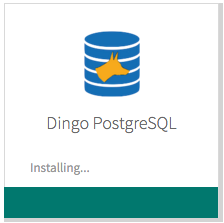

Nearly all applications running on Pivotal Cloud Foundry require a SQL database or require a NoSQL/JSON database. The best open source database for both use cases is [PostgreSQL](http://www.postgresql.org/).

The Dingo PostgreSQL ™ tile brings highly-available, disaster recoverable PostgreSQL clusters to everyone in your organization. New staff on their first day will find it simple to get started. Expert developers and PostgreSQL admins will find each service instance is a dedicated database cluster with support for custom extensions, and other superuser-only features.

It is easier to use Dingo PostgreSQL ™ for Pivotal Cloud Foundry than not to:

```
cf create-service dingo-postgresql cluster my-first-db
cf bind-service myapp my-first-db
cf restart myapp
```

## Support

Dingo PostgreSQL ™ is an orchestration platform for open source PostgreSQL, including the latest stable 9.5 release. The entire Dingo Tiles team will do whatever is necessary to help your team get started, to be successful, and to avoid running into production issues.

If your company has in-house database administrators (DBAs), experts or people who are willing to read PostgreSQL manuals and tutorials, then they will have the ability to connect to each database cluster with superuser privileges.

3rd party PostgreSQL support organizations are also welcome to assist with PostgreSQL support for one or more of your databases. [Contact Dingo Tiles team](contact.html) for suggestions.
