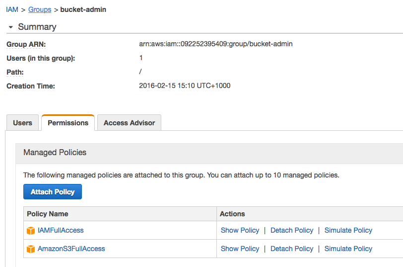

## <a id="requirements"></a>Requirements

* Pivotal Cloud Foundry&reg;
* 512M in the `system` organization
* AWS account
* AWS credentials with full S3/IAM privileges (see <a href="#iam-user">Setup AWS IAM user</a>)

## <a id="upload-tile"></a>Upload tile

The tile can be downloaded from https://www.dingotiles.com

Click "Import a Product" on the left hand side of your Ops Manager dashboard. Select the `dingo-s3-x.y.z.pivotal` file to upload.

The "Dingo S3™" product will appear in the "Available Products" list. Click "Add" to move it to the Installation Dashboard.

The first time you upload/install the tile it will appear with a red lower border. This means it is not yet ready to be installed - there are mandatory configuration that you will need to provide. Notably, the AWS API credentials.

## <a id="iam-user"></a>Setup AWS IAM user

The Dingo S3™ tile requires AWS API credentials that will be used for two purposes:

* Create & destroy S3 buckets
* Create & destroy IAM users to have read/write access to those S3 buckets

Create an AWS IAM group with `IAMFullAccess` and `AmazonS3FullAccess` policies:



Create an IAM user with this group.

Enter the user's AWS access & secret keys in the Dingo S3™ tile, and press "Save".


## <a id="installation"></a>Installation

Return to the Ops Manager dashboard via the "< Installation Dashboard" link at the top left.

The Dingo S3™ tile is now green and is ready to be installed.

Press "Apply Changes".

## <a id="verification"></a>Verification

The `dingo-s3` service should be available to all users after installation. Observe it in the marketplace:

```
cf marketplace
```

The output will look like:

```
Getting services from marketplace in org system / space dingo-s3 as admin...
OK

service          plans                     description
app-autoscaler   bronze, gold              Scales bound applications in response to load
dingo-s3         essential*                Amazon S3 is storage for the Internet.
p-mysql          100mb-dev                 MySQL service for application development and testing
redis            shared-vm, dedicated-vm   Redis service to provide a key-value store

* These service plans have an associated cost. Creating a service instance will incur this cost.
```

To confirm that you and your users can create & delete buckets:

```
cf create-service dingo-s3 essential test-bucket
```

If there are any issues with Internet access or specifically https://aws.amazon.com access, or if your AWS credentials are not sufficient, then this command will fail.

To destroy the test bucket:

```
cf delete-service test-bucket -f
```
